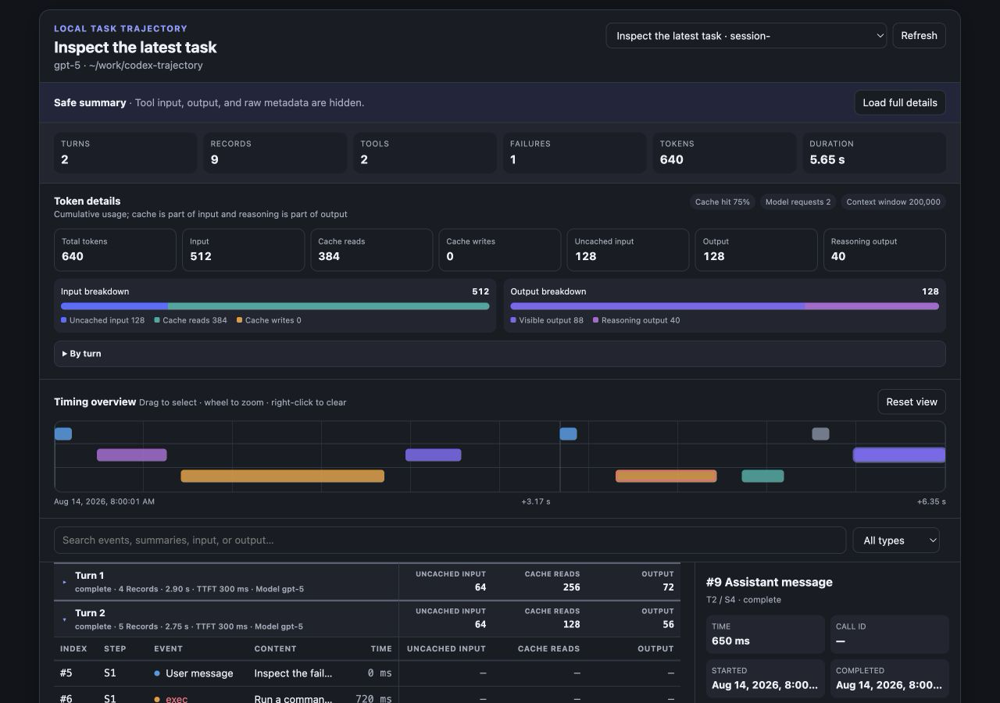

# Codex Trajectory

[](https://github.com/icesixgod/codex-trajectory/actions/workflows/ci.yml)
[](https://github.com/icesixgod/codex-trajectory/releases/latest)
[](LICENSE)

Read this in [简体中文](README.zh-CN.md).

Codex Trajectory is a read-only Codex plugin that turns local task logs into a privacy-aware event ledger and interactive timeline. It shows turns, approximate model steps, reasoning summaries, assistant messages, tool timing, subagents, compaction, token usage, and failures without changing the original logs.



## Install

Prerequisites: Codex and [uv](https://docs.astral.sh/uv/getting-started/installation/) on macOS, Linux, or Windows.

```sh
codex plugin marketplace add icesixgod/codex-trajectory
codex plugin add codex-trajectory@icesixgod
```

Open a new Codex task so the installed tools and skill are loaded. Then ask:

> Show the safe trajectory summary for this Codex task.

## Privacy model

Safe summary mode is the default. It returns event names, timing, status, token usage, and bounded summaries while hiding tool inputs, tool outputs, raw record metadata, absolute log paths, Git remotes, base instructions, and encrypted reasoning.

Full details are opt-in through `detailLevel: "full"` or the viewer's confirmation button. They expose bounded record details to the active Codex conversation, but still never return base instructions or encrypted reasoning. The plugin has no telemetry and makes no network requests. See [PRIVACY.md](PRIVACY.md).

## Tools

| Tool | Purpose |
| --- | --- |
| `list_codex_sessions` | List recent task metadata without transcript bodies. |
| `get_codex_trajectory` | Return structured trajectory data for analysis. |
| `show_codex_trajectory` | Return the trajectory with an interactive MCP Apps viewer. |

`get_codex_trajectory` and `show_codex_trajectory` accept `sessionId`, `maxRecords` (50–1000), `includeArchived`, and `detailLevel` (`summary` or `full`). Omit `sessionId` for the latest task.

The output uses [`schemaVersion: 1`](schemas/trajectory-v1.schema.json). Codex logs do not expose DeepSeek Harness step boundaries directly, so a new approximate step begins when model output resumes after one or more tool results. Unknown event types are ignored; malformed complete JSONL lines are reported in `warnings`, while an unfinished tail line is tolerated during active writes. See [the interface reference](docs/interface.md).

## Development

```sh
uv sync --group dev
uv run ruff format --check .
uv run ruff check .
uv run mypy
uv run pytest --cov --cov-report=term-missing
```

The runtime has no third-party Python dependencies. Development and tests are locked in `uv.lock`. See [CONTRIBUTING.md](CONTRIBUTING.md).

## Attribution

Portions of the event-ledger, timeline, selection, and inspector implementation are adapted from [`@deepseek-ai/dsh-client-ui-trajectory`](https://github.com/deepseek-ai/deepseek-harness/tree/master/packages/client/ui-trajectory), copyright (c) 2026 DeepSeek, under the MIT License. The complete upstream license is included in [`LICENSES/DeepSeek-Harness.txt`](LICENSES/DeepSeek-Harness.txt), with additional details in [`NOTICE`](NOTICE).

Codex Trajectory is an independent project and is not affiliated with or endorsed by DeepSeek. Codex uses a different persisted event vocabulary, and this repository bundles no DeepSeek Harness package, Cordis runtime, React runtime, TanStack Virtual package, or `diff` package.
