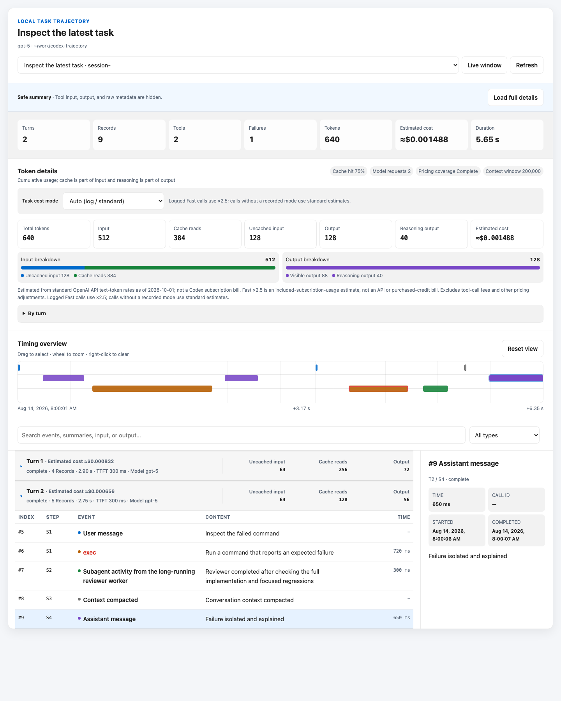

# Codex Trajectory

[](https://github.com/icesixgod/codex-trajectory/actions/workflows/ci.yml)
[](https://github.com/icesixgod/codex-trajectory/releases/latest)
[](LICENSE)

**English** · [简体中文](README.zh-CN.md)

**Version 1.0.0** · October 2, 2026 · [Changelog](CHANGELOG.md#100---2026-10-02)

See what happened in a Codex task, where time went, and how many tokens it used.

Codex Trajectory is a plugin that turns local Codex logs into a searchable event ledger and interactive timeline. Open it directly in the Codex desktop side panel.



*Captured from the current viewer on October 2, 2026, using synthetic demo data.*

## What you can see

- **Task history:** messages, saved reasoning summaries, tool calls, subagent activity, and context compaction.
- **Timing and failures:** event durations, execution status, and a timeline to locate slow calls.
- **Tokens and cost:** task and turn totals, cache usage, and estimated cost.
- **Live activity:** a scrolling event stream, token totals, cost estimates, and the latest available local quota sample.
- **History browsing:** search, event filters, task switching, and earlier records, including compressed and paginated logs.

Steps are approximate, and reasoning summaries appear only when saved in the log. Cost figures are estimates based on bundled API prices, not a Codex subscription bill. Local quota samples may lag the account service.

## Install

You need **Codex** and **[uv](https://docs.astral.sh/uv/getting-started/installation/)**. The plugin runs on macOS, Linux, and Windows.

```sh
codex plugin marketplace add icesixgod/codex-trajectory
codex plugin add codex-trajectory@icesixgod
```

Open a new Codex task to load the plugin. After updating an existing installation, fully quit and reopen Codex.

## Use

1. In the task's right panel, select **+ → More tools… → Plugins and MCPs → Codex Trajectory**.
2. Browse the timeline and event ledger. Use search and filters to find a record; select it to inspect it.
3. Click **Live window** to follow activity, or **Load earlier records** to browse history.

The native entry opens the current task without a model turn. If the host cannot identify that task, it shows a local task selector.

You can also ask Codex:

> Show the safe trajectory summary for this Codex task.

For logs larger than the default **512 MiB** read limit, choose a sufficient **Read limit (GB)** and click **Enable and retry**. The higher limit applies only to that task in the current panel; large logs take longer to scan.

## Privacy

The viewer starts with a **safe summary**: tool inputs, outputs, and raw metadata are hidden. **Load full details** asks for confirmation before exposing bounded details to the active conversation. Its checkbox can remember your choice for all tasks on this device; **Restore safe summary default** clears that preference. Live views always use safe summaries.

Source logs remain unchanged. Base instructions and encrypted reasoning are never returned. The Python runtime has no telemetry or application network requests; `uv` may download Python and dependencies during setup.

See [PRIVACY.md](PRIVACY.md) for the complete privacy model.

## MCP tools

| Tool | Use |
| --- | --- |
| `list_codex_sessions` | Find recent local tasks. |
| `get_codex_trajectory` | Read structured trajectory data. |
| `show_codex_trajectory` | Open the interactive viewer. |

Pass an explicit `sessionId` to read a specific task. Without one, the public read/show tools select the most recently modified active task, which may differ from the current task. See the [interface reference](docs/interface.md) for arguments, pagination, and schemas.

## Development

```sh
uv sync --group dev
uv run ruff format --check .
uv run ruff check .
uv run mypy
uv run pytest
```

See [CONTRIBUTING.md](CONTRIBUTING.md) for browser tests and release checks, [the native viewer guide](docs/native-viewer.md) for migration and troubleshooting, and [CHANGELOG.md](CHANGELOG.md) for changes.

## License and credits

[MIT](LICENSE). Parts of the ledger, timeline, and inspector are adapted from DeepSeek's MIT-licensed [DeepSeek Harness trajectory UI](https://github.com/deepseek-ai/deepseek-harness/tree/master/packages/client/ui-trajectory), copyright © 2026 DeepSeek. See [NOTICE](NOTICE) and the [upstream license](LICENSES/DeepSeek-Harness.txt). This is an independent project, not affiliated with or endorsed by DeepSeek.

Friendly link: [Linux.do](https://linux.do/)
