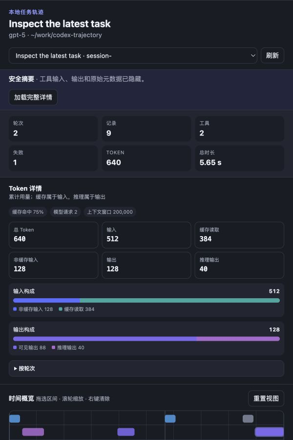

# Codex Trajectory

[](https://github.com/icesixgod/codex-trajectory/actions/workflows/ci.yml)
[](https://github.com/icesixgod/codex-trajectory/releases/latest)
[](LICENSE)

[English](README.md)

Codex Trajectory 是一个只读 Codex 插件，可将本地任务日志转换为兼顾隐私的事件账本和交互式时间轴。它展示轮次、近似模型步骤、推理摘要、助手消息、工具耗时、子代理、上下文压缩、Token 用量和失败信息，不会修改原始日志。



## 安装

前置条件：macOS、Linux 或 Windows 上已安装 Codex 和 [uv](https://docs.astral.sh/uv/getting-started/installation/)。

```sh
codex plugin marketplace add icesixgod/codex-trajectory
codex plugin add codex-trajectory@icesixgod
```

打开一个新的 Codex 任务，使插件工具和 Skill 生效，然后输入：

> 显示这个 Codex 任务的安全轨迹摘要。

## 隐私设计

默认使用安全摘要模式：返回事件名称、时间、状态、Token 用量和有长度限制的摘要，同时隐藏工具输入/输出、原始记录元数据、绝对日志路径、Git 远程地址、基础指令和加密推理。

完整详情必须通过 `detailLevel: "full"` 或界面确认按钮明确开启。完整详情会进入当前 Codex 对话，但基础指令和加密推理仍不会返回。插件没有遥测，也不会主动发起网络请求。详情见 [PRIVACY.md](PRIVACY.md)。

## 工具

| 工具 | 用途 |
| --- | --- |
| `list_codex_sessions` | 列出最近任务的元数据，不返回对话正文。 |
| `get_codex_trajectory` | 返回适合分析的结构化轨迹。 |
| `show_codex_trajectory` | 返回轨迹并渲染交互式 MCP Apps 界面。 |

后两个工具接受 `sessionId`、`maxRecords`（50–1000）、`includeArchived` 和 `detailLevel`（`summary` 或 `full`）。省略 `sessionId` 时读取最近任务。

输出遵循 [`schemaVersion: 1`](schemas/trajectory-v1.schema.json)。Codex 日志不直接记录 DeepSeek Harness 的步骤边界，因此插件在工具结果后模型再次输出时开启一个近似步骤。未知事件会被忽略；完整但损坏的 JSONL 行会进入 `warnings`，活跃写入产生的未完成尾行则被容忍。接口说明见 [docs/interface.md](docs/interface.md)。

## 开发

```sh
uv sync --group dev
uv run ruff format --check .
uv run ruff check .
uv run mypy
uv run pytest --cov --cov-report=term-missing
```

运行时没有第三方 Python 依赖，开发依赖由 `uv.lock` 锁定。贡献方式见 [CONTRIBUTING.md](CONTRIBUTING.md)。

## 来源说明

事件账本、时间轴、选择和检查器实现的部分内容改编自 MIT 许可的 [`@deepseek-ai/dsh-client-ui-trajectory`](https://github.com/deepseek-ai/deepseek-harness/tree/master/packages/client/ui-trajectory)，上游版权声明为“Copyright (c) 2026 DeepSeek”。完整上游许可证收录于 [`LICENSES/DeepSeek-Harness.txt`](LICENSES/DeepSeek-Harness.txt)，其他信息见 [`NOTICE`](NOTICE)。

Codex Trajectory 是独立项目，与 DeepSeek 不存在隶属或背书关系。Codex 使用不同的持久化事件词汇；本仓库不捆绑 DeepSeek Harness 软件包、Cordis 运行时、React 运行时、TanStack Virtual 或 `diff` 软件包。

**友情链接**

[Linux.do](https://linux.do/)
