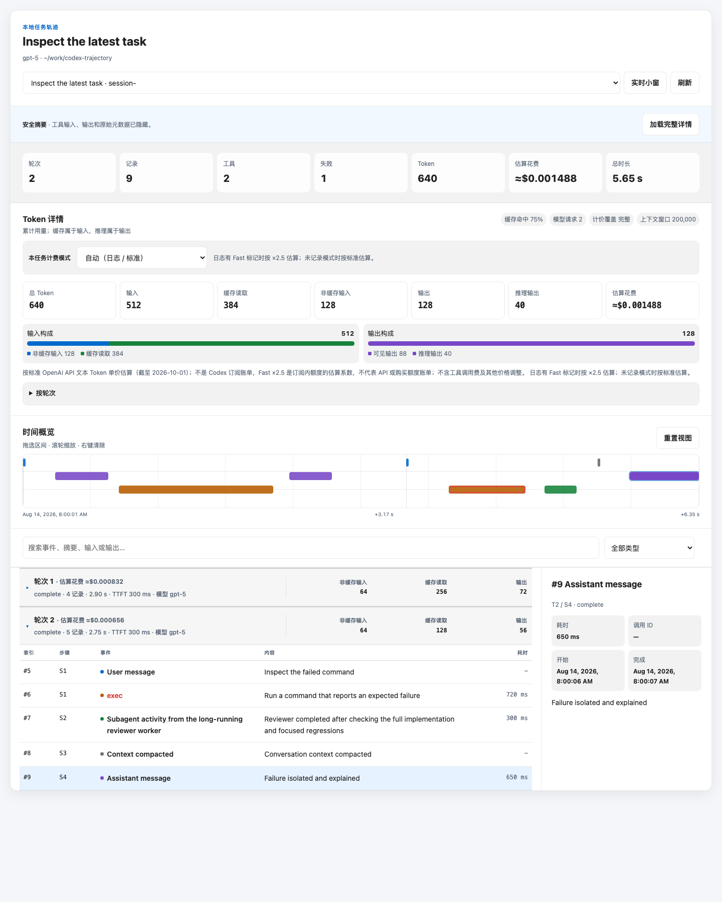

# Codex Trajectory

[](https://github.com/icesixgod/codex-trajectory/actions/workflows/ci.yml)
[](https://github.com/icesixgod/codex-trajectory/releases/latest)
[](LICENSE)

[English](README.md) · **简体中文**

**版本 1.0.0** · 2026 年 10 月 2 日 · [更新日志](CHANGELOG.md#100---2026-10-02)

看清 Codex 任务做了什么、时间花在哪里、用了多少 Token。

Codex Trajectory 将本地 Codex 日志整理成可搜索的事件账本和交互时间轴，可从 Codex 左侧工具栏 **…** 中的应用列表全屏打开，也可在任务右侧面板中打开。



*2026 年 10 月 2 日使用当前查看器截取，内容为演示数据。*

## 能看到什么

- **任务过程：**消息、日志中保存的推理摘要、工具调用、子代理活动和上下文压缩。
- **耗时与失败：**事件耗时、执行状态，以及帮助定位慢调用的时间轴。
- **Token 与费用：**任务和各轮次的用量、缓存使用情况及估算费用。
- **实时活动：**滚动事件流、Token 总量、估算费用，以及本地最新可用的额度采样。
- **历史浏览：**搜索、事件筛选、任务切换和更早记录，支持压缩日志与分页历史。

步骤划分是近似值，推理摘要仅在日志保存了摘要时显示。费用按内置 API 价格估算，不等于 Codex 订阅账单；本地额度采样也可能滞后于账户实际状态。

## 安装

需要 **Codex** 和 **[uv](https://docs.astral.sh/uv/getting-started/installation/)**，支持 macOS、Linux 和 Windows。

```sh
codex plugin marketplace add icesixgod/codex-trajectory
codex plugin add codex-trajectory@icesixgod
```

安装后新建一个 Codex 任务以加载插件。更新已有安装后，请完整退出并重新打开 Codex。

## 使用

1. 在 Codex 左侧工具栏的 **…** 应用列表中打开 **Codex Trajectory**，进入全屏查看器，并可将其固定到工具栏。也可在任务右侧面板中选择 **+ → More tools… → Plugins and MCPs → Codex Trajectory**。
2. 浏览时间轴和事件账本，用搜索与筛选定位记录，点击记录查看详情。
3. 点击 **实时小窗**跟随任务活动，或点击**加载更早记录**浏览历史。

两个原生入口都不触发模型对话。有有效任务上下文时，查看器精确打开该任务；任务上下文不可用时，显示本地任务选择器。

也可以直接对 Codex 说：

> 展示当前 Codex 任务的安全轨迹摘要。

日志超过默认 **512 MiB** 读取上限时，设置足够的**读取上限（GB）**并点击**启用并重试**。提高后的上限仅对当前面板中的该任务生效；大日志首次扫描需要更长时间。

## 隐私

查看器默认显示**安全摘要**，隐藏工具输入、输出和原始元数据。点击**加载完整详情**后，需要确认才会向当前对话提供有长度限制的详情。确认框中的选项可以为本机所有任务记住这一选择；**恢复安全摘要默认值**可清除偏好。实时视图始终使用安全摘要。

插件不修改源日志，也不返回基础指令或加密推理。Python 运行时不含遥测、不发起应用网络请求；首次配置时，`uv` 可能下载 Python 和依赖。

完整隐私说明见 [PRIVACY.md](PRIVACY.md)。

## MCP 工具

| 工具 | 用途 |
| --- | --- |
| `list_codex_sessions` | 查找近期本地任务。 |
| `get_codex_trajectory` | 读取结构化轨迹数据。 |
| `show_codex_trajectory` | 打开交互查看器。 |

读取指定任务时，请明确传入 `sessionId`。公共读取和展示工具未指定 ID 时，会选择最近修改的活跃任务，可能与当前任务不同。参数、分页和数据结构见[接口文档](docs/interface.md)。

## 开发

```sh
uv sync --group dev
uv run ruff format --check .
uv run ruff check .
uv run mypy
uv run pytest
```

浏览器测试与发布检查见 [CONTRIBUTING.md](CONTRIBUTING.md)，迁移和故障排查见[原生查看器指南](docs/native-viewer.md)，版本变化见 [CHANGELOG.md](CHANGELOG.md)。

## 许可与致谢

采用 [MIT 许可证](LICENSE)。事件账本、时间轴和检查器的部分实现改编自 DeepSeek 的 MIT 许可项目 [DeepSeek Harness trajectory UI](https://github.com/deepseek-ai/deepseek-harness/tree/master/packages/client/ui-trajectory)，版权为 © 2026 DeepSeek。详见 [NOTICE](NOTICE) 和[上游许可证](LICENSES/DeepSeek-Harness.txt)。本项目独立维护，与 DeepSeek 不存在隶属或背书关系。

友情链接：[Linux.do](https://linux.do/)
